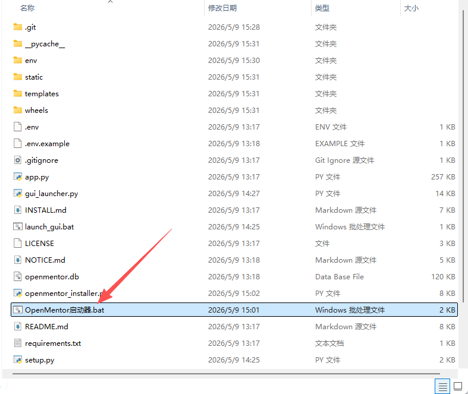
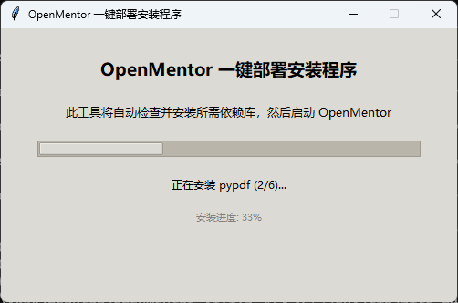
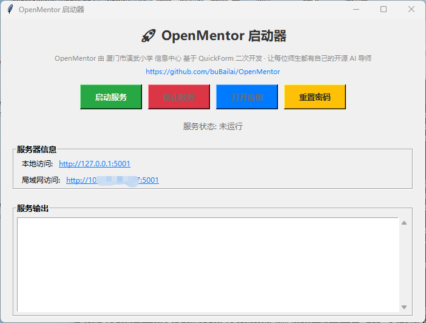

# OpenMentor 安装手册

> 面向老师的安装指南。即使你不会编程也可以按步骤完成。

## 零、最快：Windows 免安装包（推荐 Windows 用户）

Windows 系统下下载 `OpenMentor_V1.2.1_免安装包.zip`，解压后**直接双击 `OpenMentor启动器.bat`** 即可自动安装依赖并运行项目，无需手动装 Python 或 pip。



启动后会先弹出「OpenMentor 一键部署安装程序」自动补齐依赖：



随后自动打开「OpenMentor 启动器」界面，点「启动服务」即可使用：



- 本机访问地址：`http://localhost:5001`
- 局域网访问地址（学生扫码用）：`http://<局域网IP>:5001`
- 默认账号：`admin / openmentor`

> macOS / Linux 用户请看下方「零·五、用 AI Agent 辅助一键部署」或从「一、准备 Python 环境」开始的完整步骤。

---

## 零·五、推荐：用 AI Agent 辅助一键部署（适合下载纯代码版本）

如果你下载的是**纯代码版本**（`OpenMentor_V1.2.1.zip` 或源码），又不熟悉 Python / 终端命令，可以让 AI Agent 帮你完成全部安装和启动工作：

1. 从 [GitHub Releases](https://github.com/buBailai/OpenMentor/releases) 下载最新版 zip 并解压到任意安装盘下，例如：
   - Windows：`D:\OpenMentor`
   - macOS：`~/Documents/OpenMentor`
   - Linux：`~/OpenMentor`
2. 打开任意一款支持终端 / 命令执行的 AI Agent 客户端，例如：
   - **Cherry Studio**（开源跨平台 AI 客户端）
   - **Trae**（字节）
   - **Claude Code**（Anthropic）
   - **OpenClaw**
3. 把解压后的项目路径告诉 Agent，对它说 **"帮我启动这个项目"**
4. Agent 会自动检查 Python 环境 → 缺啥装啥 → 创建虚拟环境 → 安装依赖 → 启动服务 → 把访问 URL 给你

整个过程你只需要等几分钟。如果遇到错误，Agent 也能帮你排查。

> 想了解每一步细节、或者想完全手动控制，仍可继续看下面完整步骤。

---

## 一、准备 Python 环境（5 分钟）

### Windows 用户

1. 访问 [Python 官网](https://www.python.org/downloads/) 下载 **Python 3.11 或 3.12** 安装包
2. 双击安装时**务必勾选** ✅ `Add Python to PATH`
3. 完成后打开「命令提示符」，输入以下命令验证：
   ```
   python --version
   ```
   出现 `Python 3.11.x` 或更高即可。

### macOS 用户

打开「终端」，运行：

```bash
# 推荐用 Homebrew 安装（最稳）
/bin/bash -c "$(curl -fsSL https://raw.githubusercontent.com/Homebrew/install/HEAD/install.sh)"
brew install python@3.12
```

或访问 [Python 官网](https://www.python.org/downloads/macos/) 下载安装包。

### Linux 用户

```bash
# Ubuntu / Debian
sudo apt update && sudo apt install python3 python3-pip python3-venv -y

# CentOS / RHEL
sudo yum install python3 python3-pip -y
```

## 二、安装 OpenMentor（3 分钟）

### 步骤 1：下载并解压代码包

把 `OpenMentor.zip` 解压到任意目录，比如：

- Windows：`D:\OpenMentor`
- macOS：`~/Documents/OpenMentor`
- Linux：`~/OpenMentor`

### 步骤 2：进入项目目录

打开终端（Windows 是「命令提示符」），切换到上面的目录：

```bash
cd 你解压的路径
```

### 步骤 3：创建虚拟环境（推荐，避免依赖冲突）

```bash
python3 -m venv .venv
```

然后激活：

- macOS / Linux：`source .venv/bin/activate`
- Windows：`.venv\Scripts\activate`

激活后命令行前面会出现 `(.venv)`。

### 步骤 4：安装依赖

```bash
pip install -r requirements.txt
```

这一步会下载 Flask、SQLAlchemy、pypdf 等依赖（约 200 MB），耐心等待 1-3 分钟。

> 国内用户如果下载慢，可以加镜像：
>
> ```bash
> pip install -r requirements.txt -i https://pypi.tuna.tsinghua.edu.cn/simple
> ```

## 三、启动 OpenMentor（10 秒）

```bash
python app.py
```

成功启动后看到类似输出：

```
* Serving Flask app 'app'
* Running on all addresses (0.0.0.0)
* Running on http://127.0.0.1:5001
* Running on http://192.168.x.x:5001
```

记住第 3 行 `192.168.x.x:5001` 这个 IP 地址，后面学生扫码会用到。

## 四、首次登录

浏览器打开 `http://localhost:5001`，使用默认账号登录：

- 用户名：`admin`
- 密码：`openmentor`

> ⚠️ **首次登录后请立即修改密码**：右上角下拉菜单 → 个人设置 → 修改用户名/密码。

## 五、配置 AI（必做）

进入「个人设置」→ 选择一家国产 AI 模型 → 填入 API Key：

| 模型 | 申请地址 | 推荐对话模型 | 推荐图生模型 |
|---|---|---|---|
| **DeepSeek** | <https://platform.deepseek.com> | `deepseek-chat` | ❌ 暂无 |
| **豆包**（字节火山方舟）| <https://www.volcengine.com/product/ark> | `doubao-seed-1-6-vision-250815`（视觉） | `doubao-seedream-3-0-t2i-250415` |
| **阿里通义** | <https://bailian.console.aliyun.com> | `qwen-vl-plus`（视觉） | `qwen-image-2.0` |
| **智谱**（清华系）| <https://open.bigmodel.cn> | `glm-4v-flash`（**免费**） | `cogview-3-flash`（**免费**） |
| **硅基流动** | <https://siliconflow.cn> | `Qwen/Qwen2.5-72B-Instruct` | `black-forest-labs/FLUX.1-schnell` |
| **Ollama 本地** | <https://ollama.ai> | `llama3.2` 或自选 | ❌ 不支持 |

**💡 推荐组合**：
- **追求免费**：智谱 GLM（对话+图生都有免费版）
- **追求质量**：豆包视觉版（中文教学场景表现好）
- **追求速度**：DeepSeek（对话快）

填好 API Key 后点「保存」，回到主页就能开始用了。

## 六、可选：设置开机自启

### Windows 服务

```bat
sc create OpenMentor binPath= "你的路径\.venv\Scripts\python.exe 你的路径\app.py" start= auto
```

### macOS LaunchDaemon

参考 `examples/openmentor.plist`（如果项目提供）。

### Linux systemd

```ini
# /etc/systemd/system/openmentor.service
[Unit]
Description=OpenMentor
After=network.target

[Service]
Type=simple
User=teacher
WorkingDirectory=/home/teacher/OpenMentor
ExecStart=/home/teacher/OpenMentor/.venv/bin/python app.py
Restart=on-failure

[Install]
WantedBy=multi-user.target
```

## 七、常见问题

### 启动后浏览器打不开
- 检查防火墙是否拦截了 5001 端口
- 试试直接访问 `http://127.0.0.1:5001`

### 学生扫码后提示"无法访问"
- 学生设备必须与教师机在**同一 Wi-Fi/局域网**
- 检查教师机的 IP 是否还是上面那个（重启路由器后可能变）

### 安装依赖时报错
- 升级 pip：`python -m pip install --upgrade pip`
- Windows 缺少 C++ 编译器：装 [Microsoft C++ Build Tools](https://visualstudio.microsoft.com/visual-cpp-build-tools/)

### API Key 测试失败
- 检查模型名是否填对（参考第 5 步推荐）
- 检查 API Key 是否有效、是否有余额
- 豆包必须填模型名或 endpoint id（不能留空）

### 想要重置数据库
进入「个人设置」→「系统初始化」→ 执行系统初始化（会清除所有数据，慎用）

## 八、获取帮助

- 项目主页：<https://github.com/buBailai/OpenMentor>
- 上游项目 QuickForm：<https://gitee.com/wstlab/quickform>

---

🎉 安装完成！打开 [USAGE.md](./USAGE.md) 学习如何创建第一个 AI 导师。
